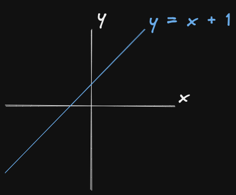
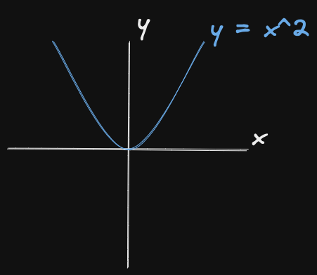
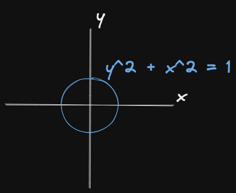
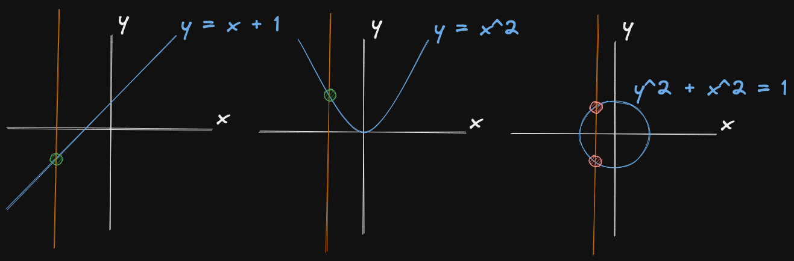
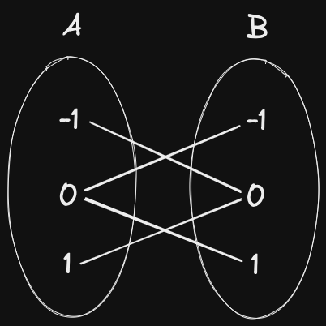

There are many types of databases, but one of the most common and widely used is
the relational database. This is the type used by database systems using SQL.

When googling "relational database", ignoring wikipedia (for now...),
the definitions from the top results (including AWS, Google Cloud, and Oracle)
are along the lines of:

> Data is stored in tables and there are relations between these tables.

This made sense to me.
I mean, it's called a "relational" database which I know uses tables,
so it must be about the relations between tables, right?

<!--
> A relational database is a type of database that stores and provides access to data points that are related to one another. Relational databases are based on the relational model, an intuitive, straightforward way of representing data in tables (Oracle)

<https://www.oracle.com/uk/database/what-is-a-relational-database/#:~:text=What%20is%20a%20Relational%20Database%20(RDBMS)%3F,of%20representing%20data%20in%20tables>.

> A relational database is a collection of information that organizes data in predefined relationships where data is stored in one or more tables (or "relations") of columns and rows, making it easy to see and understand how different data structures relate to each other. Relationships are a logical connection between different tables, established on the basis of interaction among these tables. (Google Cloud)

<https://cloud.google.com/learn/what-is-a-relational-database>

> What is a relational database? A relational database is a collection of information that organizes data points with defined relationships for easy access. (TechTarget)

<https://www.techtarget.com/searchdatamanagement/definition/relational-database>

> A relational database is a collection of data points with pre-defined relationships between them. The relational model organizes data into tables (AWS)

<https://aws.amazon.com/relational-database/>

> A relational database is a type of database. It uses a structure that allows us to identify and access data in relation to another piece of data in the database. Often, data in a relational database is organized into tables. (Codecademy)

<https://www.codecademy.com/article/what-is-rdbms-sql>

> A relational database defines database relationships in the form of tables. The tables are related to each other - based on data common to each. (W3Schools)

<https://www.w3schools.com/mysql/mysql_rdbms.asp>
-->

Wrong!

Coming back to Wikipedia, the first sentence of the article on relational databases is:

> A relational database (RDB) is a database based on the relational model of data, as proposed by E. F. Codd in 1970

<!-- <https://en.wikipedia.org/wiki/Relational_database> -->

In relational databases data is actually stored in "relations", not tables.
Well actually... relations, also known as tables.

But what are these "relations"?

## Functions

You might be wondering, why are you talking about functions?
I wanted to read about databases, not math.
Wait you mean math functions, not programming functions?
Well that's the catch, the "relations" in relational databases is actually mathematical.

A simple function you hopefully all understand is

$$
y = x + 1
$$

Here each input, $x$, is produces an output, $y$, by adding 1 to the input.

The domain of the function is the set of all possible inputs,
while the range is the set of all possible outputs.
In this case let's say the domain is all real numbers and the range is all real numbers.

This function is a one-to-one relation. Each input has exactly one output.

Another example is the function $y = x^2$.

This function is not one-to-one, as multiple inputs can have the same output.
For example when $x = 2$ and $x = -2$, $y = 4$.
Therefore this function is a many-to-one relation.

Now consider the equation for a unit circle $y^2 + x^2 = 1$.

This is actually not a function, but why?
Well that's because it's a many-to-many relation.
When $x = 0$, $y = 1$ and $y = -1$.

You might have heard about the vertical line test.
If you are given a graph, you can determine if it is a function by
drawing a vertical line through the graph.
If the line intersects the graph at more than one point,
then the graph is not a function.

But if it's not a function, then what is it?

## Relations

A relation!

You may, or may not have noticed, I used the term "relation" in the previous section.

> This function is a one-to-one *relation*

> Therefore this function is a many-to-one *relation*

A function is a just special type of relation.
It's a one-to-one or many-to-one relation,
while many-to-many (or one-to-many) relations are not functions.

Another way to look at a relation is that
it is a connection between the elements of the two sets.

Consider the equation for a unit circle $y^2 + x^2 = 1$,
with the domain, set $A$, and range, set $B$ being all integers
(this reduces the amount of numbers I need to write by, let's just say, a lot).

The equation defines some sort of rule that determines for
which elements of set $A$ and set $B$ there is a connection.

Another way to define a relation is by listing the pairs of elements that are connected.

For example, the relation for the unit circle, that is,
the set of $(x, y)$ pairs of integers on the unit circle, is

${ (0, 1), (0, -1), (1, 0), (-1, 0) }$

What we are doing here is selecting the pairs of elements that are connected,
from all possible pairs of elements.
That is, this is a subset of all possible pairs of elements
(the Cartesian product of the two sets).

Now let me just format the pairs of elements better...

| A  | B  |
|----|----|
| 0  | 1  |
| 0  | -1 |
| 1  | 0  |
| -1 | 0  |

Oh hey! Look at that! It's a table!

## Tables (a.k.a. Relationships)
